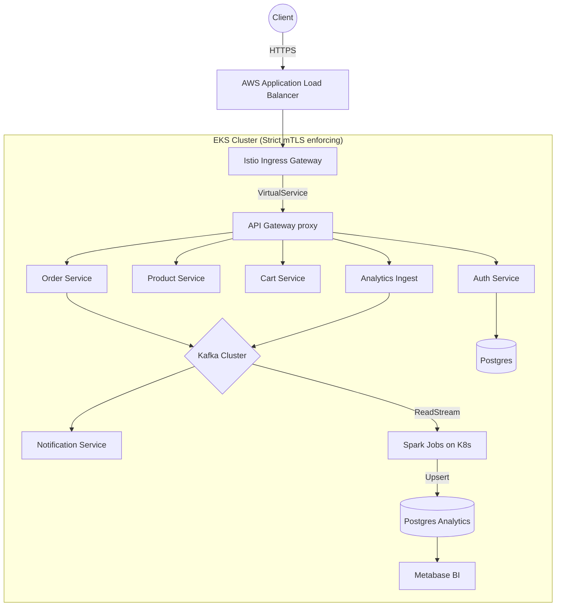

# 🛒 Enterprise Cloud-Native E-Commerce Platform Base

**Classification:** Internal Platform Engineering Documentation  
**Tier:** 1 (Mission Critical)  
**Owners:** `@platform-engineering`, `@data-engineering`, `@sre-core`

---

## 📖 Platform Overview
This repository contains the declarative state for the Enterprise E-Commerce Platform. It unifies Application Engineering (19 independent Go microservices), Cloud Infrastructure (Terraform/AWS EKS), Data Engineering (Kafka/Spark Structured Streaming), and Security (Global mTLS, ExternalSecrets) under a strict GitOps methodology managed by ArgoCD.

> [!WARNING]
> **Strict GitOps Enforcement:** Modifying Kubernetes resources manually via `kubectl apply` or `helm upgrade` in the production cluster is a critical violation of policy. All changes must be committed to this repository. ArgoCD (`selfHeal: true`) will aggressively overwrite manual drift within 3 minutes.

---

## 🏛️ Platform Architecture
### System Design Philosophy
The platform is designed around the principles of **high availability**, **horizontal scalability**, **fault isolation**, and **zero-trust networking**. We leverage a purely declarative GitOps model extending from infrastructure (Terraform) to application deployment (ArgoCD + Helm).

### Bounded Contexts of Microservices
Microservices are strictly separated by domain (e.g., Auth, Cart, Order, Product). Direct database sharing is prohibited. Inter-service communication occurs synchronously via gRPC/HTTP through the Istio Service Mesh, or asynchronously via Kafka topics. 

### Control Plane vs Data Plane
- **Control Plane:** AWS EKS managed control plane. ArgoCD operates as the continuous deployment controller. Istiod manages mesh configurations and certificate issuance.
- **Data Plane:** Envoy sidecars intercept and route all intra-cluster traffic. Data persistence is offloaded to managed AWS RDS (Postgres), ElastiCache (Redis), and MSK (Kafka).

### Service Mesh Topology & Network Segmentation
The platform enforces a Default-Deny network topology via Kubernetes `NetworkPolicy` and Istio `AuthorizationPolicy`. 
Inbound external traffic is terminated at the AWS ALB, routed to the Istio Ingress Gateway, and pushed to the `api-gateway`. The `api-gateway` routes traffic to core services. Core services are restricted from communicating with unrelated domains.



---

## 🔐 Security Model
### Zero-Trust Networking & mTLS Enforcement
All service-to-service communication is encrypted in transit using **mTLS STRICT** mode enforced by Istio. Pods without Envoy sidecars or presenting invalid certificates are instantly rejected.

### IAM Boundaries & IRSA Usage
IAM Roles for Service Accounts (IRSA) enforce least-privilege cloud access. A service running in EKS (e.g., `order-service`) is bound to a specific IAM Role via OIDC (`order-service-irsa`). This role explicitly dictates access to AWS resources (S3, SQS, KMS, Secrets Manager). **Monolithic wide-access roles are banned.**

### Secret Rotation Policy
Secrets are mastered in **AWS Secrets Manager**. We use the **External Secrets Operator (ESO)** to continuously sync changes. Passwords, API keys, and certificates are rotated automatically via AWS Lambda triggers every 30 days. ESO syncs these updates into native Kubernetes Secrets within 1 minute.

### PodSecurityStandards
Platform-wide admission controllers enforce `Restricted` Pod Security Standards (PSS):
- `runAsNonRoot: true`
- `readOnlyRootFilesystem: true`
- `allowPrivilegeEscalation: false`
- `capabilities: drop: ["ALL"]`

### Supply Chain Security
All Docker images are built distroless, signed using **Cosign** (Sigstore), and pushed to ECR. Kyverno admission policies verify the cryptographic signature of the image before scheduling the pod. 

---

## 🏗️ GitOps Governance
### ArgoCD Sync Waves
To prevent race conditions during cold starts or disaster recovery scenarios, ArgoCD deployments use explicit Sync Waves:
1. **Wave -10:** CRDs and Namespaces
2. **Wave -5:** Service Mesh (Istio) & Security (External Secrets)
3. **Wave 0:** Databases, Caches, & Messaging (Postgres, Redis, Kafka)
4. **Wave 5:** Observability & Tooling
5. **Wave 10:** Microservices

### Drift Detection & Change Approval
ArgoCD continuously monitors the cluster state against the Git repository. Any drift triggers an immediate alert to `#alerts-platform-drift` and auto-heals within 3 minutes.
All code and infrastructure changes require PR reviews, passing CI (linting, tests, security scans), and explicit approval from a CODEOWNER.

### Environment Promotion Strategy
Code merges cascade automatically: `dev` ➔ `staging` ➔ `prod`. 
Production promotion requires a manual approval step in GitHub Actions before standardizing the Git SHA over to the `prod` ArgoCD application paths.

---

## 🚀 Deployment Strategy
### Progressive Delivery (Argo Rollouts)
We utilize **Argo Rollouts** to orchestrate safe deployment strategies. The standard microservice profile uses a **Canary Deployment**:
- **Step 1:** Route 10% of traffic to the new replicaset.
- **Step 2:** Pause automatically to collect Prometheus metrics (latency, error rates).
- **Step 3:** If SLOs are met, upscale to 50% traffic.
- **Step 4:** Pause for final validation before 100% promotion.

### Failure Rollback Procedure & Blast Radius Control
If error rates spike during a rollout, Argo Rollouts instantly aborts the canary, shifts 100% of traffic back to the stable replicaset, and scales down the failing pods.
Network Policies and Pod Anti-Affinity rules ensure that the blast radius of a pod crash or network disruption is isolated strictly to that specific AZ and service context.

---

## ⚙️ Reliability Engineering
### SLOs, SLIs, and Error Budgets
Each service is mandated to define strict Service Level Objectives (SLOs) tracked via Prometheus:
- **Availability:** 99.99% successful responses (HTTP 2xx, 3xx, 4xx).
- **Latency:** 95th percentile (P95) response time < 200ms.

### Rate Limiting & Circuit Breaking
Istio `DestinationRules` and `EnvoyFilters` implement aggressive backpressure control:
- **Circuit Breaking:** Triggers if a backend service returns 5xx errors for >10 seconds, failing fast to prevent cascading connection pool exhaustion.
- **Rate Limiting:** Protects the `api-gateway` and heavyweight endpoints via Redis-backed token bucket algorithms natively via Envoy.

### Retry Strategies
Idempotent methods (GET, PUT, DELETE) are configured for transparent retries within the mesh (max 3 retries, exponential backoff) before surfacing a 503 Service Unavailable to the client.

---

## 🔭 Observability
### Metrics, Tracing, and Logging
- **Metrics:** Instrument code via OpenTelemetry SDKs. Auto-scraped by **Prometheus**.
- **Distributed Tracing:** Implemented globally via W3C Trace Context propagating through Istio and Go binaries. Collected by the **OpenTelemetry Collector** and visualized in **Grafana Tempo**.
- **Log Aggregation:** Fluent Bit daemonsets forward completely structured JSON logs to **Loki**.
  
### Golden Signals & Alerting Strategy
Alertmanager routes critical P0 pages to PagerDuty tracking the Four Golden Signals:
1. **Latency:** Time taken to service a request (P99 spikes).
2. **Traffic:** Total demand on the system (RPS).
3. **Errors:** Rate of failing requests (5xx spikes).
4. **Saturation:** Resource constraints (CPU/Memory throttling, Connection Pool exhaustion).

---

## 🚨 Disaster Recovery
### RPO / RTO Definitions
- **Recovery Point Objective (RPO):** 5 minutes for relational databases; 1 hour for analytics data.
- **Recovery Time Objective (RTO):** < 15 minutes for full cluster reconstruction via GitOps (excluding data restoration).

### Region Failure Handling
In the event of an `us-east-1` total regional outage, global DNS (Route53) shifts traffic to `us-west-2`. The secondary cluster runs active-standby synced via ArgoCD.

### Kafka & Database Restore Procedures
- **Kafka:** Handled via MSK multi-AZ replication.
- **RDS Postgres:** Continuous WAL archiving allows Point-In-Time-Recovery (PITR). Restore initiates via an automated GitHub Action triggering Terraform state modifications.

---

## 📈 Data Platform
### Event Streaming Model
The Data Platform heavily leverages Kafka as an event-driven backbone. The core philosophy centers on a single immutable source of truth (`page.viewed`, `order.created`).

### Exactly-Once Guarantees & Idempotency
Consumers process data with exactly-once semantics using offset tracking and idempotent database handlers. 
- **Spark Structured Streaming:** Checkpoints process offsets to GCS/S3. If a pod is evicted, it seamlessly resumes from the precise last committed offset.
- **Microservices:** Implement `idempotency_key` headers and database unique constraints (UPSERT) to guard against duplicate message delivery intrinsic to at-least-once Kafka guarantees.

---

## 💰 Cost Governance
### Cluster Autoscaling & Spot Instances
The EKS cluster utilizes **Karpenter** for rapid node provisioning.
- **Stateless Workloads:** Scheduled on AWS Spot Instances requiring aggressive graceful shutdown handling.
- **Stateful Workloads:** Scheduled on strictly On-Demand nodes.

### Resource Quotas & Cost Monitoring
All namespaces strictly enforce `ResourceQuotas` and `LimitRanges`. Individual Pods must declare Request/Limit bounds.
**Kubecost** continually aggregates cloud billing and Prometheus metrics to attribute dollar costs logically per namespace and deployment.

---

## ✅ Platform Verification
### Production Readiness Checklist
Before any new service is merged, the CODEOWNER verifies:
* [ ] NetworkPolicy restricts ingress/egress appropriately.
* [ ] `readOnlyRootFilesystem` and SecurityContext drops all capabilities.
* [ ] PDB specifies `minAvailable: 1`.
* [ ] HPA targets CPU utilization accurately.
* [ ] IRSA role has minimum viable permissions.
* [ ] Canary steps are validated in Rollout manifest.

### Deployment Validation & Smoke Tests
Following a GitOps sync, a post-deploy Argo Hook triggers an automated smoke test suite validating core integration points via the `api-gateway`.

---

## 📘 Platform Runbooks
### Immediate Triage
- **Service Crash Recovery:** Argo Rollouts auto-aborts. Identify the panic trace in Loki.
- **Pod Eviction Handling:** Validate `metrics-server` output. Typically indicates memory limits exceeded (OOMKilled). Increase limits or fix memory leak.
- **Kafka Lag Mitigation:** `kubectl get hpa -n apps-async`. If consumers are maxed, temporarily increase `maxReplicas` and evaluate partition keys for skew.
- **Secret Sync Failures:** Describe the `ExternalSecret` resource. Validate the IRSA role mapping and AWS Secrets Manager key existence.
- **Network Routing Failures:** Inspect `NetworkPolicy` mapping and Istio `VirtualService` configurations using `istioctl analyze`.

---

## 🛠️ Appendices

### Standard Kubectl Debug Commands
```bash
# View rollout status and canary progression
kubectl argo rollouts get rollout <service-name> -n apps-core --watch

# Trace ESO credential sync errors
kubectl describe externalsecret <secret-name> -n apps-core
kubectl logs -l app.kubernetes.io/name=external-secrets -n external-secrets

# Verify Istio mTLS STRICT policies
istioctl authn tls-check <pod-name> -n apps-core

# Validate HPA utilization matching
kubectl get hpa -n apps-core -w
```
